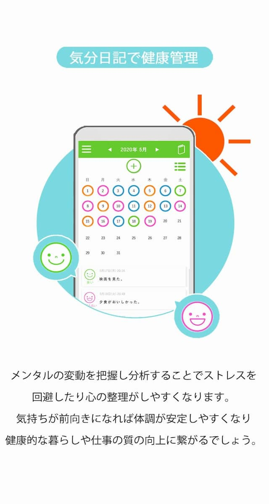

🎨 気分トラッカー（Mood Tracker）

🔍 概要

このプロジェクトは、JavaScript・HTML・CSS・Canvas API を使って作成した「気分記録アプリ」です。ユーザーは「快適」「普通」「悲しい」などの感情を選び、現在の気分をキャンバスに表示できます。

📌 主な特徴

😽 表情（絵文字）を Canvas に表示

🎨 背景色の変化とアニメーション効果

📱 レスポンシブ対応（スマホでも見やすい）

✨ JavaScript の DOM 操作の学習成果

🔧 使用技術

HTML / CSS / JavaScript

Canvas API（2D 描画）

DOM イベントリスナー

CSS アニメーション

💻 デモページ

https://masaakiii.github.io/mood-tracker/

🎨 気分トラッカー（Mood Tracker）

🔍 概要

このプロジェクトは、JavaScript・HTML・CSS・Canvas API を使って作成した「気分記録アプリ」です。ユーザーは「快適」「普通」「悲しい」などの感情を選び、現在の気分をキャンバスに表示できます。

📌 主な特徴

😽 表情（絵文字）を Canvas に表示

🎨 背景色の変化とアニメーション効果

📱 レスポンシブ対応（スマホでも見やすい）

✨ JavaScript の DOM 操作の学習成果

🔧 使用技術

HTML / CSS / JavaScript

Canvas API（2D 描画）

DOM イベントリスナー

CSS アニメーション

💻 デモページ

https://masaakiii.github.io/mood-tracker/

📸 スクリーンショット

🧑‍💻 制作

Masaakiii
https://github.com/Masaakiii

📸 スクリーンショット

🧑‍💻 制作

Masaakiii
https://github.com/Masaakiii
